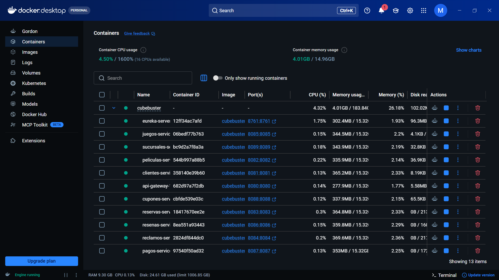
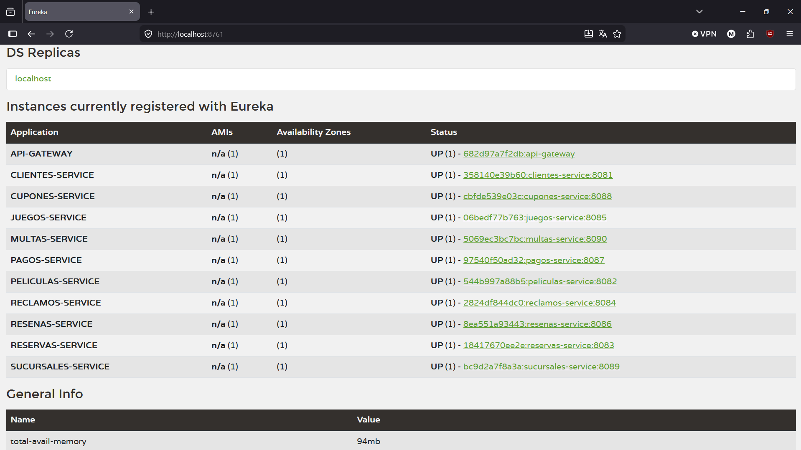
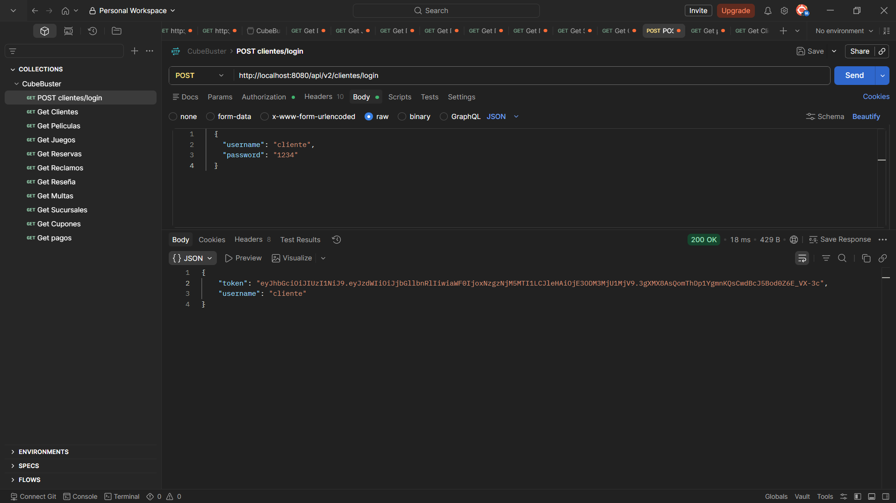
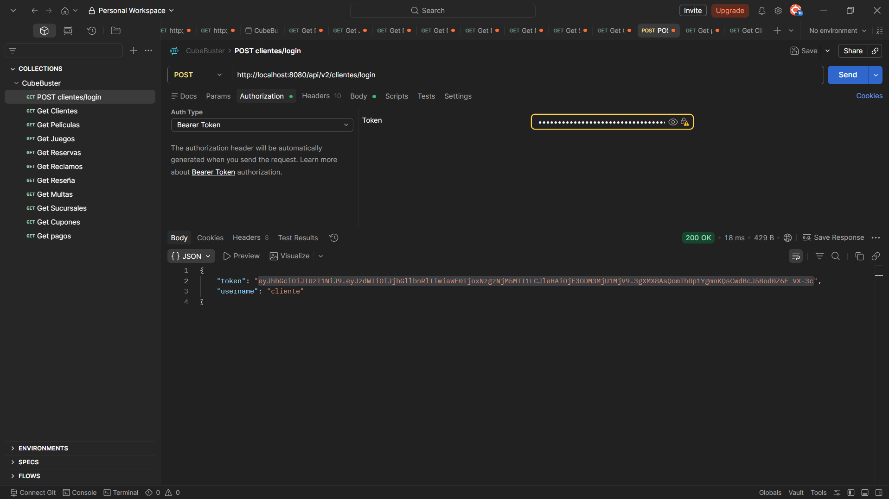
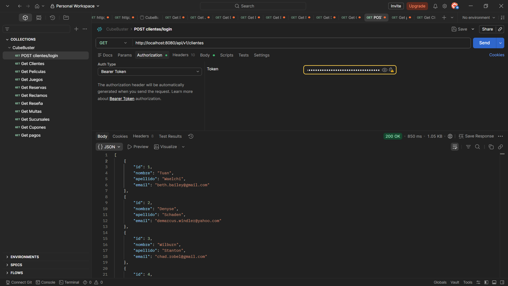
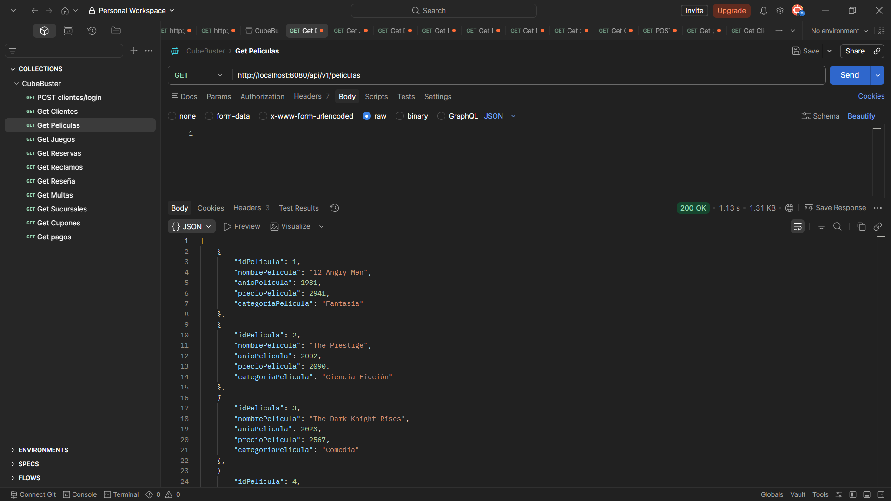
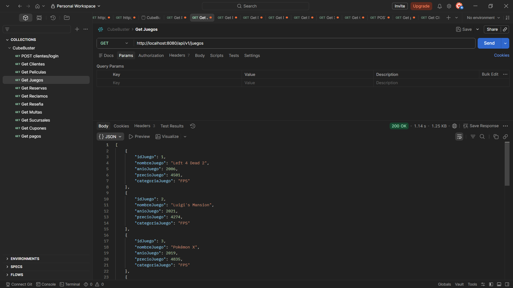
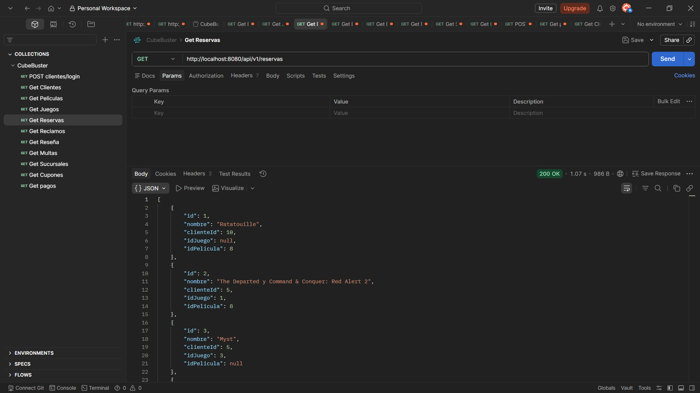
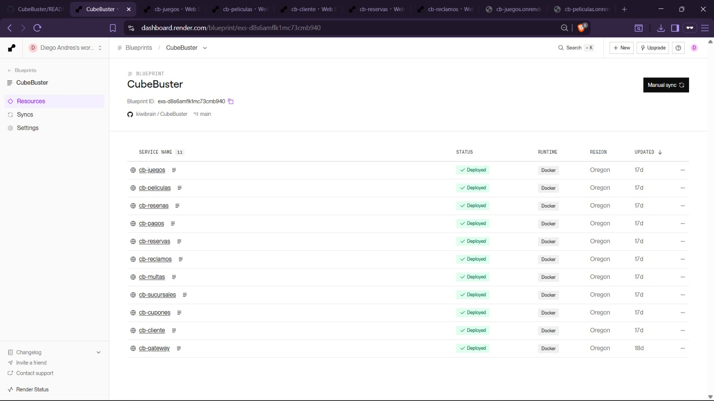

# CubeBuster - Blockbuster Nostalgia API

CubeBuster es una tienda con el objetivo de revivir la nostalgia de Blockbuster, para los amantes de las películas en formatos físicos y juegos de los años 90 y 2000. El proyecto incluye un simple sistema de reservas que permite a los clientes rentar una película, un juego o ambos a la vez. Además, permite a los usuarios escribir un reclamo o una sugerencia a la tienda si lo desean, siempre y cuando estén registrados como cliente en el sistema.

## Arquitectura y Tecnologias
Este proyecto está construido bajo una arquitectura **Microservicios**.
- **Framework:** Spring Boot (Java 21)
- **Enrutamiento:** Spring Cloud Gateway & Netflix Eureka Server
- **Bases de Datos (Híbridas):** MySQL en la nube (Aiven) para datos persistentes y H2 en memoria para entornos locales.
- **Generación de Datos:** DataFaker (Perfil `dev`)
- **Despliegue:** Docker Desktop (Local) y Render (Nube)

---
## Guia de Ejecución Local (Docker Desktop)
Para levantar este proyecto de manera local, asegúrese de tener instalado **Docker Desktop**, **Java 21** y **Maven**.

### 1. Clonar el repositorio
```
git clone https://github.com/kiwibrain/CubeBuster.git
cd [NOMBRE_DE_LA_CARPETA-DONDE-SE-CLONARA]
```

### 2. Empaquetar los Microservicios
Antes de levanta Docker, es necesario compilar los archivos `.jar`. Ejecute el siguiente comando en la terminal (se omiten los tests para evitar errores por variables de entorno de la nube):
```
mvn clean package -DskipTests
```

### 3. Levantar la arquitectura con Docker
Ejecute el siguiente comando para construir y levantar todos los contenedores:
```
docker compose up --build
```
**Nota sobre Datafaker:** Al levantar los contenedores, el sistema detectará automáticamente si las tablas están vacías y utilizará DataFaker para inyectar 10 registros de prueba realistas en cada microservicio.




---
## Servicios y Puertos (Eureka)
Una vez que Docker finalice (1-2 minutos aprox.), el Servidor Eureka estará disponible para monitorear la salud de los microservicios.
**Panel de Eureka:** `http://localhost:8761`




---
## Seguridad y Autenticación (JWT)
El microservicio de Clientes (y aquellos que dependen de él) se encuentra protegido mediante **JSON Web Tokens (JWT)**. Para poder consumir los endpoints protegidos, el usuario debe autenticarse primero.

### Paso 1: Generar el Token (Login)
- **POST** `http://localhost:8080/api/v1/clientes/login`
- **Body (JSON):**
  ```
  {
      "username": "admin",
      "password": "password"
  }
  ```
Ingrese las credenciales de prueba configuradas en el sistema. Si la petición es exitosa, el servidor devolverá un código `200 OK` con el Token JWT generado.




### Paso 2: Usar el Token (Bearer Auth)
Para consumir endpoints protegidos (como listar clientes o hacer reservas), debe incluir este token en su petición:
1. En Postman, vaya a la pestaña **"Authorization"**.
2. Seleccione el tipo "Bearer Token".
3. Pegue el Token generado en el Paso 1.
4. Lance su petición GET, POST, PUT o DELETE normalmente.




---
## Pruebas con Postman (API Gateway)
Todas las peticiones deben pasar por el API Gateway en el puerto `8080`. El Gateway se encargará de enrutar la petición al microservicio correspondiente usando Eureka.
A continuación, se presentan los endpoints principales para probar la generación de datos (DataFaker):

**Clientes**
...* GET `http://localhost:8080/api/v1/clientes`




**Peliculas**
...* GET `http://localhost:8080/api/v1/peliculas`




**Juegos**
...* GET `http://localhost:8080/api/v1/juegos`




**Reservas (Ejemplo de Relaciones)**
...* GET `http://localhost:8080/api/v1/reservas`




**URLs para los otros servicios:**
...* **Reclamos:** GET `http://localhost:8080/api/v1/reclamos`
...* **Pagos:** GET `http://localhost:8080/api/v1/pagos`
...* **Cupones:** GET `http://localhost:8080/api/v1/cupones`
...* **Sucursales:** GET `http://localhost:8080/api/v1/sucursales`
...* **Multas:** GET `http://localhost:8080/api/v1/multas`

---
## Navegación HATEOAS
Nuestras respuestas JSON han sido enriquecidas utilizando el estándar HATEOAS (Hypermedia as the Engine of Application State).
Al solicitar un recurso (por ejemplo, obtener un cliente), el JSON de respuesta no solo incluirá los datos del cliente, sino también una sección `_links` con las URLs exactas para realizar acciones relacionadas a ese recurso (ej. `self`, `update`, `delete`), facilitando la navegación de la API.

---
## Despliegue de la Nube (Render + Aiven)
El proyecto también se encuentra desplegado en la nube para acceso público, separando la base de datos de los servidores de aplicación.

1. **Base de Datos (Aiven):** 5 de nuestros microservicios están conectados a un clúster de MySQL alojado en Aiven. Esto garantiza que la información sea persistente y accesible desde internet, superando las limitaciones de la base de datos H2 en memoria.

2. **Servidores (Render):** La ejecución de los contenedores fue delegada a Render. El servicio utiliza variables de entorno inyectadas de forma segura para conectarse a Aiven.
**Enlaces públicos de API Gateway en Render:** `https://cb-gateway.onrender.com`

Para probar el proyecto en la nube, utilice la URL anterior en Postman seguido de las rutas correspondientes (ej: `.../api/v1/clientes`).




